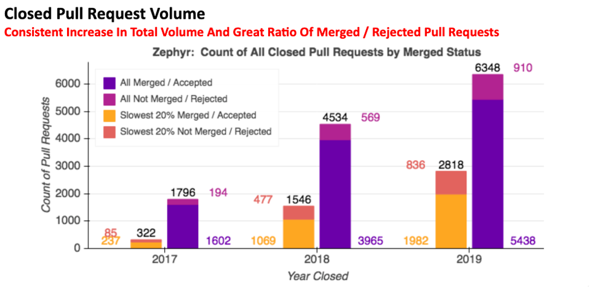
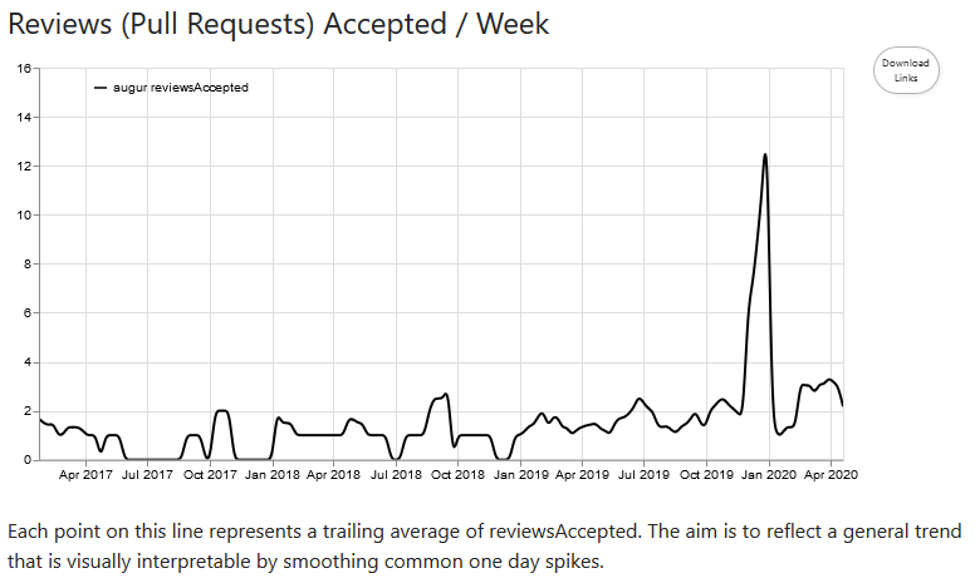

# Change Request Acceptance Ratio

Question: What is the ratio of change requests accepted to change requests closed without being merged?

## Description
Each change request can be in one of three states: open, merged (accepted), and closed without merge (declined). This metric measures the ratio of change requests merged (accepted) vs change requests closed without being merged.

## Objectives
The ratio of change requests merged to change requests closed without merging provides insight into several repository characteristics, including openness to outside contributions, growth of the contributor community, the efficiency of code review processes, and, when measured over time, the trajectory of a project in its evolution. Different ratios should be interpreted in the context of each repository or project.

## Implementation
**Parameters**
Time Period Granularity (Weekly, Monthly, Annually). Change in ratio over the period of time.
Show contributor count
Origin of change request: branch or fork? Change requests from repository forks are more commonly from outside contributors, while branch originating change requests come from people with repository commit rights.

**Aggregators**
Total change requests merged (accepted)
Total change requests closed without merge
Total change requests in an open state

### Visualizations (optional)

CHAOSS tools provide a number of visualizations for this metric. The first visualization shows the accepted and declined change requests organized annually, from which ratios can be derived.

Figure One:

Figure Two:

Figure Three:

### Tools Providing the Metric (optional)
https://github.com/chaoss/augur
https://github.com/chaoss/augur-community-reports

### Data Collection Strategies

Accepted change requests are defined as in the [Change Requests Accepted	](https://chaoss.community/metric-change-requests-accepted/) metric, and
Declined change requests are defined as in the [Change Requests Declined](https://chaoss.community/metric-change-requests-declined/) metric.

## References
Augur Zephyr report on pull requests: https://docs.google.com/presentation/d/11b48Zm5Fwsmd1OIHg4bse5ibaVJUWkUIZbVqxTZeStg/edit#slide=id.g7ec7768776_1_56
