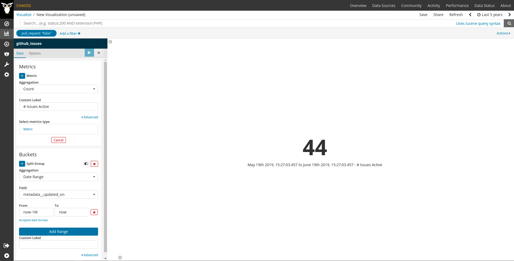

# Issues Active

Question: How many issues were active during a certain period? 

## Description

Issues are defined as in [Issues New](https://chaoss.community/metric-issues-new/).
Issues showing some activity are those that had some comment,
or some change in state (including closing the issue),
during a certain period.

For example, in GitHub Issues, a comment, a new tag, or
the action of closing an issue, is considered as a sign of activity.

## Objectives

* Volume of active issues in a project.
    Active issues are a proxy for the activity in a project.
    By counting active issues related to code in the set of repositories corresponding
    to a project, you can have an idea of the overall activity in
    working with issues in that project.
    Of course, this metric is not the only one that should be
    used to track volume of coding activity.

## Implementation

**Aggregators:**
* Count. Total number of active issues during the period.
* Ratio. Ratio of active issues over total number of issues during that period.

**Parameters:**
* Period of time. Start and finish date of the period during which issues are considered. Default: forever.

* Criteria for source code. Algorithm. Default: all issues are related to
  source code.  
    If we focus on source code, we need a criterion for deciding
    whether an issue is related to the source code or not.

### Filters 

* By actor (submitter, commenter, closer). Requires merging identities corresponding to the same author.
* By groups of actors (employer, gender... for each of the actors).
Requires actor grouping, and likely, actor merging.

### Visualizations 

* Count per period over time
* Ratio per period over time

These could be grouped by applying the previously defined filters.
These could be represented as bar charts, with time running in the X axis.
Each bar would represent proposals to change the code
during a certain period (eg, a month).

### Tools Providing the Metric

* [GrimoireLab](https://chaoss.github.io/grimoirelab) provides data for computing a metric close to the one described in this page for GitHub Issues, GitLab issues, Jira, Bugzilla and Redmine. In terms of the metric, **GrimoireLab data have only the date of the last update of each item, which limits computing this metric to time ranges ending on the current date**.
  - Depending on the source API, the definition of what is considered an update on the issue could vary. GrimoireLab uses `metadata__updated_on` to store latest issue update, please check [Perceval documentation](https://perceval.readthedocs.io/en/latest/search.html?q=metadata_updated_on&check_keywords=yes&area=default) to look for the specific API field being used in each case and understand its limitations, if any.
  - Currently, there is no dashboard showing this in action. Nevertheless, it is easy to build a visualization that shows the number uses which last activity occurred at some point between a date and current date (we'll do it for GitHub Issues here).
  - Add a sample visualization to any GrimoreLab Kibiter dashboard following these instructions:
    * Create a new `Metric` visualization.
    * Select the `github_issues` index.
    * Filter: `pull_request` is `false`.
    * Metric: `Count` Aggregation, `# Issues Active` Custom Label.
    * Buckets: `Date Range` Aggregation, `metadata__updated_on` Field, `now-1M` From (or whatever interval may fit your needs), `now` To, leave Custom Label empty to see the specific dates in the legend.
    * Have a look at the time picker on the top right corner to make sure it is set to include the whole story of the data so we are not excluding any item based on its creation date.
  - Example screenshot:
    
    .

### Data Collection Strategies 

**Specific description: GitHub**

In the case of GitHub, active issues are defined as "issues
which get a comment, a change in tags, a change in assigned
person, or are closed".

**Specific description: GitLab**

In the case of GitLab, active issues are defined as "issues
which get a comment, a change in tags, a change in assigned
person, or are closed".

**Specific description: Jira**

In the case of Jira, active issues are defined as "issues
which get a comment, a change in state, a change in assigned
person, or are closed".

**Specific description: Bugzilla**

In the case of Bugzilla, active issues are defined as "bug reports
which get a comment, a change in state, a change in assigned
person, or are closed".

## References
