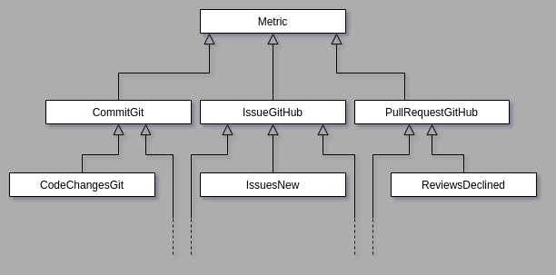
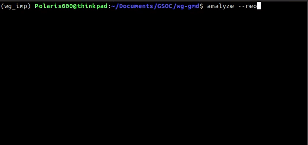

# Reference implementations

[](https://travis-ci.org/chaoss/wg-evolution)
[](https://coveralls.io/github/chaoss/wg-evolution)

This directory contains **reference implementations** for the metrics defined by the **Evolution working group**. These reference implementations use data fetched by [Perceval](https://github.com/chaoss/grimoirelab-perceval) and they show how each of the defined metrics could be implemented, in detail.

All of these reference implementations are not intended to be especially efficient in performance or ready for production, but simple and easy to follow with examples of how the intended metrics can be computed.

## List of reference implementations

| metric | plain python script | pandas script | plain python notebook | pandas notebook | description |
| --- | --- | --- | --- | --- | --- |
| **Code Changes** | [module](./scripts/code_changes_git.py) | [with-pandas](./code_df/code_changes_git.py) | [notebook](./notebooks/code_changes_git.ipynb) | [with-pandas notebook](./notebooks_df/code_changes_git.ipynb)| [description](https://github.com/chaoss/wg-evolution/blob/master/metrics/Code_Changes.md) |
| **Code Changes Lines** | [module](./scripts/code_changes_lines_git.py) | [with-pandas](./code_df/code_changes_lines_git.py) | [notebook](./notebooks/code_changes_lines_git.ipynb) | [with-pandas notebook](./notebooks_df/code_changes_lines_git.ipynb)| [description](https://github.com/chaoss/wg-evolution/blob/master/metrics/Code_Changes_Lines.md) |
| **Reviews** | [module](./scripts/reviews_github.py) | [with-pandas](./code_df/reviews_github.py) | [notebook](./notebooks/reviews_github.ipynb) | [with-pandas notebook](./notebooks_df/reviews_github.ipynb)| [description](https://github.com/chaoss/wg-evolution/blob/master/metrics/Reviews.md) |
| **Reviews Accepted** | [module](./scripts/reviews_accepted_github.py) | [with-pandas](./code_df/reviews_accepted_github.py) | [notebook](./notebooks/reviews_accepted_github.ipynb) | [with-pandas notebook](./notebooks_df/reviews_accepted_github.ipynb)| [description](https://github.com/chaoss/wg-evolution/blob/master/metrics/Reviews_Accepted.md) |
| **Reviews Declined** | [module](./scripts/reviews_declined_github.py) | [with-pandas](./code_df/reviews_declined_github.py) | [notebook](./notebooks/reviews_declined_github.ipynb) | [with-pandas notebook](./notebooks_df/reviews_declined_github.ipynb)| [description](https://github.com/chaoss/wg-evolution/blob/master/metrics/Reviews_Declined.md) |
| **Reviews Duration** | [module](./scripts/reviews_duration_github.py) | [with-pandas](./code_df/reviews_duration_github.py) | [notebook](./notebooks/reviews_duration_github.ipynb) | [with-pandas notebook](./notebooks_df/reviews_duration_github.ipynb)| [description](https://github.com/chaoss/wg-evolution/blob/master/metrics/Reviews_Duration.md) |    
  
  
  
## Contents of this directory

We use **Python Jupyter notebooks** as the framework for producing the implementations that will be explanatory in regard to the analysis performed. These notebooks come in two flavors:

* [notebooks](./notebooks/) are reference implementations using
plain Python for computing the metrics.
In these cases, the data produced by Perceval is processed as
a Python list, using plain Python mechanisms as much as possible.

* [notebooks_df](./notebooks_df/) are reference implementations
using Pandas data frames as the basis for computing the metrics.
In these cases, the data produced by Perceval is converted to a Pandas
dataframe, and then processed to produce the metrics.

Notebooks are exported as Python modules. These are more useful
if you intend to look only at the code:

* [scripts](./scripts/) are notebooks in the [notebooks](./notebooks/)
directory exported as Python modules

* [code_df](./code_df/) are notebooks in the [notebooks_df](./notebooks_df/)
directory exported as Python modules

 For the implementations, you can find the following modules:

####**Root module ([module](./scripts/metric.py) [with-pandas](./code_df/metric.py))**:     
This file contains the root class, `Metric`. All other classes inherit from it. It takes JSON data collected by Perceval and converts it into a form easier to analyze: like a dataframe, or a list of dictionaries.  

#### **Category modules**:  
These classes provide basic functionality which is common to all metric classes working on the same category of data: commits, issues or pull request.
The three category modules are:
    + **commit_git.py ([module](./scripts/commit_git.py) [with-pandas](./code_df/metric.py))**
    + **issue_github.py ([module](./scripts/issue_github.py) [with-pandas](./code_df/metric.py))**
    + **pullrequest_github.py ([module](./scripts/pullrequest_github.py) [with-pandas](./code_df/metric.py))**

#### **Individual Metric modules**:  
These are python scripts exported from the reference implementation notebooks. They inherit from the Category modules, but have the functionality to calculate the value of the metric they correspond to. For the pandas version of the implementations, the time-series can be generated for a particular metric. 

#### **source code check ([module](scripts/conditions.py) [with-pandas](code_df/conditions.py))**:  
An important aspect of several metrics is how source code is defined. This module provides several algorithms, which help define source code. Currently, the following are provided:

  - Naive
  - DirExclude
  - PostfixExclude  
    
In the case of metrics using Git, restrictions on the kinds of commits being considered can be imposed. For example, one can consider only those commits made on the master branch, or exclude empty or merge commits. Currently, the following restrictions are provided:

  - MasterInclude
  - EmptyExclude
  - MergeExclude  

#### **utilities ([module](./scripts/utils.py) [with-pandas](./code_df/utils.py))**:  
The following functionality is provided:
- covert dates in string format to datetime objects
- read json files into a python list

To summarize, the class hierarchy for both kinds of implementations is:



#### **analyze ([script](../bin/analyze))**:  
A script for evaluating the values of Evolution WG metrics on user data.
Data is fetched using Perceval's back-ends and metrics are evaluated on it.

The results of the analysis can be output in several different formats.
Currently, json, pdf, markdown and images are supported.




## How to use the script

First clone the repository.
```bash
$ git clone https://github.com/chaoss/wg-evolution.git
$ cd wg-evolution
```
To use the script, install the library with pip:

```bash
$ pip install -e .
```

The script can then be run via the command line:
```bash
$ analyze -r chaoss/wg-evolution
```

**Usage**
```bash
usage: analyze [-h] [-t API_TOKEN] -r REPO [-s SINCE] [-u UNTIL]
           [-cat {commit,issue,pull_request} [{commit,issue,pull_request} ...]]
           [-c {MergeExclude,EmptyExclude,MasterInclude} [{MergeExclude,EmptyExclude,MasterInclude} ...]]
           [-i {Naive,PostfixExclude,DirExclude} [{Naive,PostfixExclude,DirExclude} ...]]
           [-pf POSTFIXES_TO_EXCLUDE [POSTFIXES_TO_EXCLUDE ...]]
           [-de DIRS_TO_EXCLUDE [DIRS_TO_EXCLUDE ...]] [-p PERIOD]
           [-o {markdown,json,pdf,images} [{markdown,json,pdf,images} ...]]
           [-d] [-w WRITE_TO]

Analyze script argument parser

optional arguments:
  -h, --help            show this help message and exit
  -t API_TOKEN, --api-token API_TOKEN
                        GitHub API token.
                        
  -r REPO, --repo REPO  GitHub repository, as 'owner/repo'.
                        
  -s SINCE, --since SINCE
                        Start date for item consideration. ('%Y-%m-%d'
                        format).
                        
  -u UNTIL, --until UNTIL
                        End date for item consideration. ('%Y-%m-%d' format).
                        
  -cat {commit,issue,pull_request} [{commit,issue,pull_request} ...], --categories {commit,issue,pull_request} [{commit,issue,pull_request} ...]
                        The types of datasource to consider for analysis.
                        Possible options: commit, issue, pull_request (any
                        combination).
                        
  -c {MergeExclude,EmptyExclude,MasterInclude} [{MergeExclude,EmptyExclude,MasterInclude} ...], --conds {MergeExclude,EmptyExclude,MasterInclude} [{MergeExclude,EmptyExclude,MasterInclude} ...]
                        Restrictions on which commits to include. Possible
                        options: MergeExclude, EmptyExclude, MasterInclude
                        (any combinations).
                        
  -i {Naive,PostfixExclude,DirExclude} [{Naive,PostfixExclude,DirExclude} ...], --is-code {Naive,PostfixExclude,DirExclude} [{Naive,PostfixExclude,DirExclude} ...]
                        Definition of Source Code.Possible options: Naive,
                        PostfixExclude, DirExclude (any combination).
                        
  -pf POSTFIXES_TO_EXCLUDE [POSTFIXES_TO_EXCLUDE ...], --postfixes-to-exclude POSTFIXES_TO_EXCLUDE [POSTFIXES_TO_EXCLUDE ...]
                        Files to be excluded based on their
                        extension.Examples: .md, README.
                        
  -de DIRS_TO_EXCLUDE [DIRS_TO_EXCLUDE ...], --dirs-to-exclude DIRS_TO_EXCLUDE [DIRS_TO_EXCLUDE ...]
                        Files to be excluded based on their path. Examples:
                        tests, bin, docs.
                        
  -p PERIOD, --period PERIOD
                        period for time-series: 'M', 'W', 'D', etc. Any valid
                        pandas Period frequency.
                        
  -o {markdown,json,pdf,images} [{markdown,json,pdf,images} ...], --output-formats {markdown,json,pdf,images} [{markdown,json,pdf,images} ...]
                        Possible options: markdown, json, pdf, images (any
                        combination).
                        
  -d, --debug           Set debug mode for logging.
                        
  -w WRITE_TO, --write-to WRITE_TO
                        Results output path.
```

**Some Examples:**

* Run all commit metrics on chaoss/wg-evolution, starting from January 01, 2018
and using the api-token xxxx:
```bash
$ analyze -r chaoss/wg-evolution -s 2018-01-01 -t xxxx  -cat commit
```

* Run all metrics on chaoss/grimoirelab-perceval and generate a pdf report
of the results:
```bash
$ analyze -r chaoss/grimoirelab-perceval -o pdf
```

* Run commit metrics on chaoss/wg-evolution considering only non-empty commits
created on the master branch
```bash
$ analyze -r chaoss/wg-evolution -cat commit -c EmptyExclude MasterInclude
```

## How to run the notebooks

[](https://mybinder.org/v2/gh/chaoss/wg-gmd/master?filepath=implementations)

You can run the notebooks directly in [Binder](https://mybinder.org): just click on the "launch binder" logo above.

You can also run the notebooks locally on your computer.
For that, you need a Python3 environment with certain modules installed
(it is recommended to use a virtual environment, see [Creation of virtual environments](https://docs.python.org/3/library/venv.html)).

- To install the modules, just use pip3:
```bash
$ git clone https://github.com/chaoss/wg-evolution.git
$ cd wg-evolution
$ pip install -r notebook_requirements.txt
$ cd implementations/notebooks_df
```
*Note: check the specific imports made in each notebook at the top just in case more modules need to be installed.*

- Launch Jupyter from the command line:
```bash
$ jupyter notebook
```

- This will launch the Jupyter kernel, and will open your default browser
with the directory with all the notebooks loaded.
Click on the notebook you want to run, and you're ready to go.
More detailed instructions can be found in
[Introducing the Notebook Server’s Command Line Options](https://jupyter-notebook.readthedocs.io/en/stable/config.html).

- Once you have the notebook in your browser, you can execute the selected cell
by clicking `[CTRL][Enter]`, or `[Shift][Enter]`. In the latter case,
the current cell will be run, and the next one will be selected.
For selecting any cell, just click on it.

- So, if you want to execute the whole dashboard, just select the first cell,
and click `[Shift][Enter]` until you're done.
You can also click on the Cell menu, and select "Run All",
which will also run all the cells in the notebook.
More details can be found in [Executing a notebook](https://jupyter-notebook-beginner-guide.readthedocs.io/en/stable/execute.html#executing-a-notebook).

- Just click on a cell to start editing.

*Note:If you want more details and context about Jupyter notebooks, have a look at
[Jupyter Notebook Tutorial](https://www.datacamp.com/community/tutorials/tutorial-jupyter-notebook).*


## Adding reference implementations

### Files to be created for each metric
Every metric that is defined by the Evolution working group is implemented in two forms: a plain Python implementation, and another one which makes use of Pandas data structures, particularly data frames.

Each metric also has a jupyter notebook dedicated to it, and the python scripts associated with a metric are derived from this notebook. The notebook discusses key functionality and also discusses how the metric is computed.  


### Naming convention
A **metric module** follows the following naming convention:
```
<name of the metric>_<data source>.py
```
For example, `code_changes_git.py` or `reviews_accepted_github.py`.
All issue and pull request related metrics use the `github` api as a data source while all commit metrics use `git`.
Notebooks follow the same convention.

A **metric class** follows a similar naming convention but uses camel-case and eliminates the underscore characters.
```
class <name of the metric><data source>(<parent module>):
    pass
```
As an example, consider the class for the Reviews Duration metric, which can be found in `reviews_duration_github.py`. It is named `ReviewsDurationGitHub`, following the convention described above.  


### Structure of a metric class
The pandas version of a metric has the `compute` and the `_agg` methods, while the non-pandas or plain Python version only has the `compute` method. The `compute` method calculates the value of the metric for the given time period while `_agg` returns a data frame to the `time_series` method defined in
`metric.py`.

Apart from the above, each metric class also has an `__str__` and a `_get_params` method. The `_get_params` method makes it easier to create timeseries plots of a metric's value.

Thus, the `CodeChangesLinesGit` class is structured like so:
```python
class CodeChangesLinesGit(CommitGit):
    def _flatten(self, item):
        pass

    def compute(self):
        pass

    def _agg(self, df, period):
        pass

    def _get_params(self):
        pass

    def __str__(self):
        pass
```
The `_flatten` method is actually for overriding `CommitGit`'s method for more specific functionality. Thus, you won't find this method in all metric classes.  


### Adding Tests
Every metric module has unit-tests written for it. These tests improve the reliability of the metric implementations and make future development more efficient.

More information on writing tests for metric implementations can be found [here](./tests/README.md).  


## Notes
* Every metric is computed for all the items in the data structure used to instantiate the
corresponding class.
If a data structure contains items of a single repository,
only that repository will be considered for calculating the metric.
Likewise, using the data of an entire project,
(consisting of several repositories)
will result in the metric being computed for the entire project and not for each individual repository. 

* Another assumption is that the JSON data file used for the metric computation has items of the same kind, for example: commits, issues or pull requests.  
