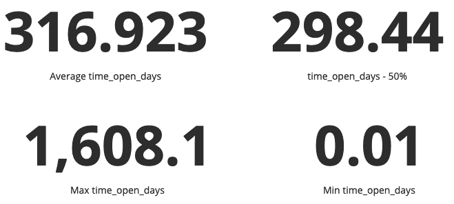

# Issue Age

Question: What is the average time that open issues have been open?

## Description
This metric is an indication of how long issues that are currently open have been open. This also includes issues that have been re-opened (counting from their initial open date).

## Objectives
When the issue age is increasing, identify the oldest open issues in a project to gain insight as to why they have been open for an extended period of time. Additionally, to understand how well maintainers are resolving issues and how quickly bugs are resolved. 

## Implementation
For all open issues, get the date the issue was opened and calculate the number of days to current date.

**Aggregators:**
* Average. Average age of all currently open issues.

**Parameters:**
* Period of time. Start and finish date of the period. Default: forever.
 Period during which issues are considered.

### Filters
* Module or working group
* Tags/labels on issue

### Visualizations

1. Summary data for open issues

2. Count of open issues per day

### Tools Providing the Metric

* [GrimoireLab](https://chaoss.github.io/grimoirelab/)
* [Augur](http://augur.osshealth.io/api_docs/#api-Evolution-Open_Issue_Age_Repo_)

### Data Collection Strategies 

For specific descriptions of collecting data about closed issues, please refer to the [corresponding section of Issues New](./Issues_New.md#data-collection-strategies).

## References
