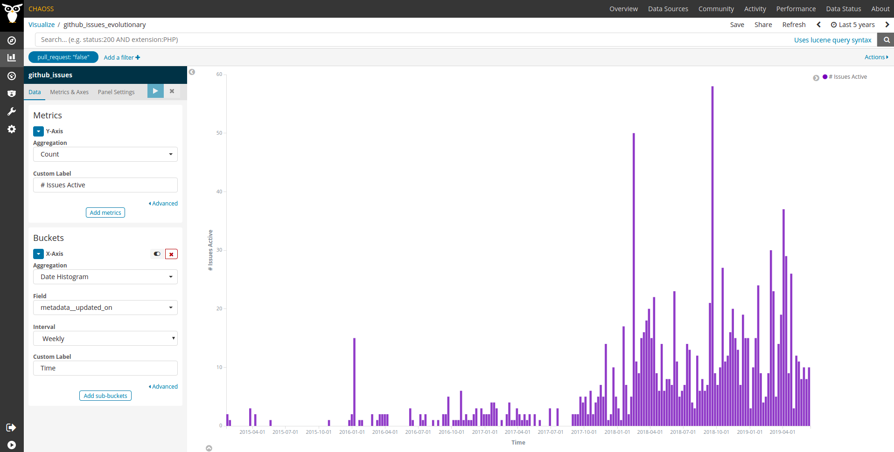

# Issues Active

Issues related to the source code that showed some activity
during a certain period.

## Description

Issues are defined as in [Issues](Issues.md).
Issues showing some activity are those that had some comment,
or some change in state (including closing the issue),
during a certain period.

For example, in GitHub Issues, a comment, a new tag, or
the action of closing an issue, is considered as a sign of activity.

### Parameters

Mandatory:

* Period of time. Start and finish date of the period. Default: forever.

    Period during which issues are considered.

* Criteria for source code. Algorithm. Default: all issues are related to
  source code.

    If we are focused on source code, we need a criteria for deciding
    whether an issues is related to the source code or not.

### Aggregators

Usual aggregators are:

* Count. Total number of active issues during the period.

## Specific description: GitHub

In the case of GitHub, active issues are defined as "issues
which get a comment, a change in tags, a change in assigned
person, or are closed",
as long as they are related to source code files.

### GitHub parameters

None.

## Specific description: GitLab

In the case of GitLab, active issues are defined as "issues
which get a comment, a change in tags, a change in assigned
person, or are closed",
as long as they are related to source code files.

### GitLab parameters

None.

## Specific description: Jira

In the case of Jira, active issues are defined as "issues
which get a comment, a change in state, a change in assigned
person, or are closed",
as long as they are related to source code files.

### Jira parameters

None.

## Specific description: Bugzilla

In the case of Bugzilla, active issues are defined as "bug reports
which get a comment, a change in state, a change in assigned
person, or are closed",
as long as they are related to source code files.

### Bugzilla parameters

None.

## Use Cases

* Volume of active issues in a project.

    Active issues are a proxy for the activity in a project.
    By counting active issues related to code in the set of repositories corresponding
    to a project, you can have an idea of the overall activity in
    working with issues in that project.
    Of course, this metric is not the only one that should be
    used to track volume of coding activity.

## Filters

Usual filters and bucketing are:

* By actors (submitter, commenter, closer). Requires actor merging
(merging ids corresponding to the same author).

* By groups of actors (employer, gender... for each of the actors).
Requires actor grouping, and likely, actor merging.

## Visualizations

Some useful visualizations are:

* Count per month over time
* Count per group over time

These could be represented as bar charts, with time running in the X axis.
Each bar would represent proposals to change the code
during a certain period (eg, a month).

## Reference Implementation

[ To be done. ]

## Known Implementations

* [GrimoireLab](https://chaoss.github.io/grimoirelab) provides data for computing this metric for GitHub Issues, GitLab issues, Jira, Bugzilla and Redmine. Depending on the source API, the definition of what is considered an update on the issue could vary. GrimoireLab uses `metadata__updated_on` to store latest issue update, please check [Perceval documentation](https://perceval.readthedocs.io/en/latest/search.html?q=metadata_updated_on&check_keywords=yes&area=default) to look for the specific API field being used in each case and understand its limitations, if any.
  - Currently, there is no dashboard showing this kind of metric. Nevertheless, it is easy to build a visualization that shows issues based on latest update (we'll do it for GitHub Issues here).
  - Add a sample visualization to any GrimoreLab Kibiter dashboard following these instructions:
    * Create a new `Vertical Bar` chart.
    * Select the `github_issues` index.
    * Filter: `pull_request` is `false`.
    * Metrics Y-axis: `Count` Aggregation, `# Issues Active` Custom Label.
    * Buckets X-axis: `Date Histogram` Aggregation, `metadata__updated_on` Field, `Weekly` Interval (or whatever interval may fit your needs, depending on the whole time range you wish to visualize in the chart), `Time` Custom Label.
  - Example screenshot: .

## External References (Literature)
