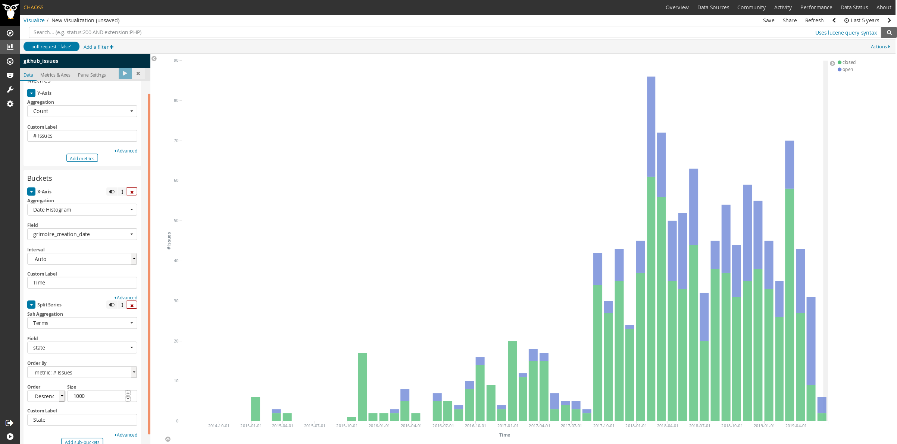

# Issues New

New issues related to the source code, during a certain period.

## Description

Projects discuss how they are fixing bugs, or adding new features,
in tickets in the issue tracking system.
Each of these tickets (issues) are opened (submitted) by a certain
person, and are later commented and annotated by many others.

Depending on the issue system considered,
an issue can go through several states (for example, "triaged",
"working", "fixed", "won't fix"), or being tagged with one or more
tags, or be assigned to one or more persons.
But in any issue tracking system, an issue is usually a collection
of comments and state changes, maybe with other annotations.
Issues can also be, in some systems, associated to
milestones, branches, epics or stories. In some cases,
some of these are also issues themselves.

At least two "high level" states can usually be identified:
open and closed. "Open" usually means that the issues is not
yet resolved, and "closed" that the issue was already resolved,
and no further work will be done with it. However, what can be
used to identify an issue as "open" or "closed" is to some extent
dependent on the issue tracking system, and on how a given project
uses it.

In real projects, filtering the issues that are directly releated to
source code is difficult, since the issue tracking system may be
used for many kinds of information, from fixing bugs and discussing
implementation of new features, to organizig a project event or
to ask questions about how to use the results of the project.

In most issue trackers, issues can be reopened after being closed.
Reopening an issue can be considered
as opening a new issue (see parameters, below).

For example, "issues" correspond to "issues" in the case of GitHub,
GitLab or Jira, to "bug reports" in the case of Bugzilla, and to
"issues" or "tickets" in other systems.

### Parameters

Mandatory:

* Period of time. Start and finish date of the period. Default: forever.

    Period during which issues are considered.

* Criteria for source code. Algorithm. Default: all issues are related to
  source code.

    If we are focused on source code, we need a criteria for deciding
    whether an issues is related to the source code or not.

* Reopen as new. Boolean. Default: False.

    Criteria for defining whether reopened issues are considered
    as new issues.

### Aggregators

Usual aggregators are:

* Count. Total number of issues during the period.

## Specific description: GitHub

In the case of GitHub, an issue is defined as an "issue",
as long as it is related to source code files.

The date of the issue can be defined (for considering it in a period or not)
as the date in which the issue was opened (submitted).

### GitHub parameters

None.

## Specific description: GitLab

In the case of GitHub, an issue is defined as an "issue",
as long as it is related to source code files.

The date of the issue can be defined (for considering it in a period or not)
as the date in which the issue was opened (submitted).

### GitLab parameters

None.

## Specific description: Jira

In the case of Jira, an issue is defined as an "issue",
as long as it is related to source code files.

The date of the issue can be defined (for considering it in a period or not)
as the date in which the issue was opened (submitted).

### Jira parameters

None.

## Specific description: Bugzilla

In the case of Bugzilla, an issue is defined as a "bug report",
as long as it is related to source code files.

The date of the issue can be defined (for considering it in a period or not)
as the date in which the bug report was opened (submitted).

### Bugzilla parameters

None.

## Use Cases

* Volume of issues discussed in a project.

    Issues are a proxy for the activity in a project.
    By counting issues discussing code in the set of repositories corresponding
    to a project, you can have an idea of the overall activity in
    discussing issues in that project.
    Of course, this metric is not the only one that should be
    used to track volume of coding activity.

## Filters

Usual filters and bucketing are:

* By actors (submitter, commenter, closer). Requires actor merging
(merging ids corresponding to the same author).

* By groups of actors (employer, gender... for each of the actors).
Requires actor grouping, and likely, actor merging.

## Visualizations

Some useful visualizations are:

* Count per month over time
* Count per group over time

These could be represented as bar charts, with time running in the X axis.
Each bar would represent proposals to change the code
during a certain period (eg, a month).

## Reference Implementation

[ To be done. ]

## Known Implementations

* [GrimoireLab](https://chaoss.github.io/grimoirelab) provides this metric out of the box for GitHub Issues, GitLab issues, Jira, Bugzilla, and Launchpad.
  - View an example on the [CHAOSS instance of Bitergia Analytics](https://chaoss.biterg.io/app/kibana#/dashboard/GitHub-Issues).  
  - Download and import a ready-to-go dashboard containing examples for this metric visualization from the [GrimoireLab Sigils panel collection](https://chaoss.github.io/grimoirelab-sigils/panels/github-issues/).
  - Add a sample visualization to any GrimoreLab Kibiter dashboard following these instructions:
    * Create a new `Vertical Bar` chart
    * Select the `github_issues` index
    * Filter: `pull_request` is `false`
    * Metrics Y-axis: `Count` Aggregation, `# Issues` Custom Label
    * Buckets X-axis: `Date Histogram` Aggregation, `grimoire_creation_date` Field, `Auto` Interval, `Time` Custom Label
    * Buckets Split Series: `Terms` Sub Aggregation, `state` Field, `metric: # Issues` Order By, `Descending` Order, `1000` Size, `State` Custom Label
  - Example screenshot: 

## External References (Literature)
