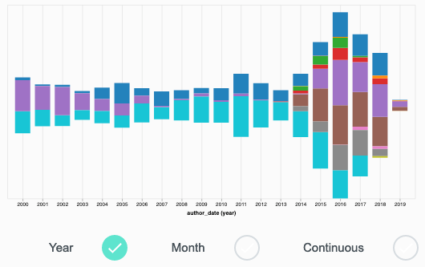

# Code Commits

## 1. Description
What is the number of code commits?

## 2. Use Cases
Community Manager

## 3. Formula
RepositoryCommits - WhiteSpaceRepositoryCommits during a time period. 

## 4. Sample Filter and Visualization
* Commits by week filter * 
    - For a given repository, show me the commits by week
    
    

    
    
    


## 5. Sample Implementation
**Augur Git Repository Implementation**

```python
@annotate(tag='commits-by-week')
def commits_by_week(self, repo_url):
    """
    Returns number of patches per commiter per week
    :param repo_url: the repository's URL
    """
    commitsByMonthSQL = s.sql.text("""
        SELECT email AS author_email, affiliation, WEEK AS `week`, YEAR AS `year`, patches FROM repo_weekly_cache 
        WHERE repos_id = (SELECT id FROM repos WHERE git LIKE :repourl LIMIT 1)
        GROUP BY email, WEEK, YEAR
        ORDER BY YEAR, WEEK, email ASC
    """)
    results = pd.read_sql(commitsByMonthSQL, self.db, params={"repourl": '%{}%'.format(repo_url)})
    return results
```

## 6. Known Implementations
* Augur
* Grimoirelab

## 7. Test Cases (Examples)
\[Work in progress\]


## 8. External References (Literature)

- Bird, C., Rigby, P. C., Barr, E. T., Hamilton, D. J., German, D. M., & Devanbu, P. (2009). The Promises and Perils of Mining Git. In 2009 6th IEEE International Working Conference on Mining Software Repositories (pp. 1–10). https://doi.org/10.1109/MSR.2009.5069475
- Finley, K. (n.d.). Github Has Surpassed Sourceforge and Google Code in Popularity. Retrieved December 9, 2012, from http://readwrite.com/2011/06/02/github-has-passed-sourceforge
- Ma, Y., Li, H., Hu, J., Xie, R., & Chen, Y. (2017). Mining the Network of the Programmers: A Data-Driven Analysis of GitHub (pp. 165–168). ACM Press. https://doi.org/10.1145/3127404.3127431
- Rosen, C., Grawi, B., & Shihab, E. (2015). Commit Guru: Analytics and Risk Prediction of Software Commits. In Proceedings of the 2015 10th Joint Meeting on Foundations of Software Engineering (pp. 966–969). New York, NY, USA: ACM. https://doi.org/10.1145/2786805.2803183
- Weicheng, Y., Beijun, S., & Ben, X. (2013). Mining GitHub: Why Commit Stops Exploring the Relationship between Developer’s Commit Pattern and File Version Evolution. In 2013 20th Asia-Pacific Software Engineering Conference (APSEC) (Vol. 2, pp. 165–169). https://doi.org/10.1109/APSEC.2013.133

